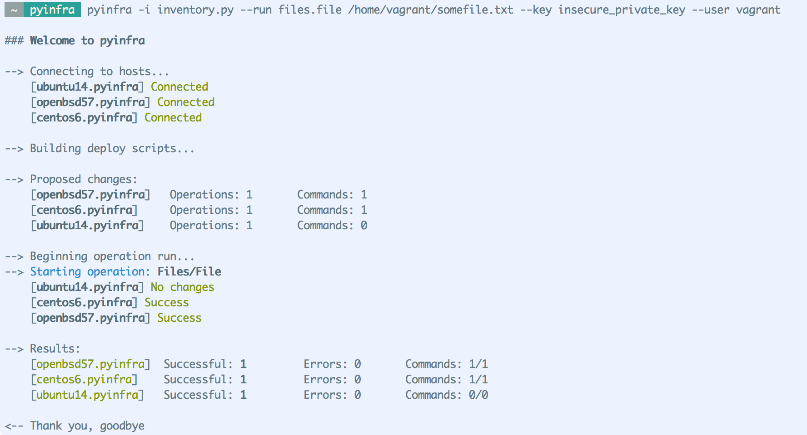

<h1></h1>

 

pyinfra is designed to automate/provision/manage/deploy servers at scale.

It can be used for ad-hoc command execution, service deployment, configuration management; you could say that pyinfra is like a combination of Ansible + Fabric. It is asynchronous, highly performant and can target thousands of hosts in parallel. It is entirely configured in Python, allowing for near-infinite extendability out of the box.

+ [Getting started](https://pyinfra.readthedocs.org/page/getting_started.html)
+ [Documentation](https://pyinfra.readthedocs.org)
+ [Example deploy](example)
+ [API Example](https://pyinfra.readthedocs.org/page/api/example.html)
+ [How the deploy works](https://pyinfra.readthedocs.org/page/deploy_process.html)

When you run pyinfra you'll see something like:

## Design Features

pyinfra was designed to deploy things in a consistent, debuggable and maintainable manner. Notable design decisions:

+ properly agentless - even Python isn't required on the remote side (just a shell!)
+ always print raw stderr on operation failure for _instant_ debugging
+ `-v` means print out remote stdout & stderr in realtime
+ outputs shell commands and files to upload
+ two-step deploy that enables dry-runs
+ fail fast where possible (eg touching a directory)
+ uses pure, 100% Python for the inventory and deploy scripts
    * with operations/hooks to safely use Python mid-deploy
