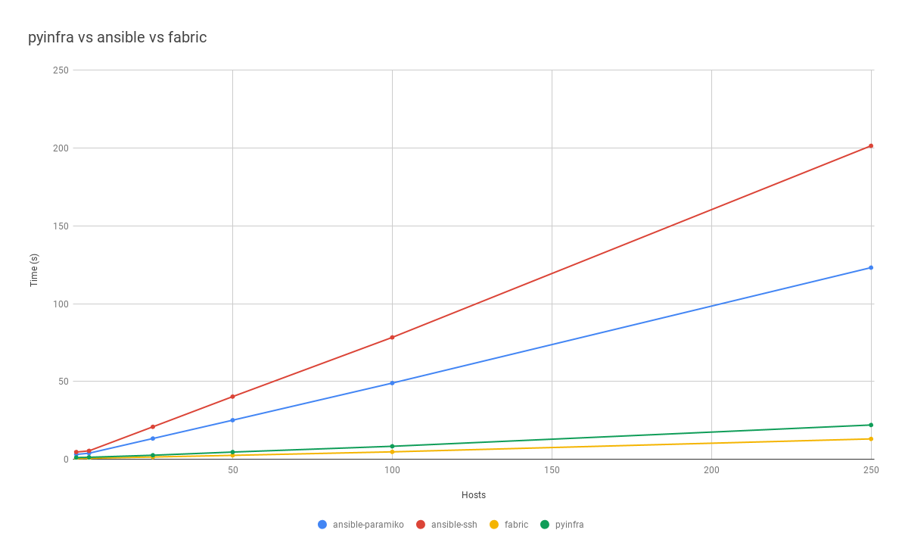

Performance
===========

One of the reasons pyinfra was started was performance of agent-less tools at the time. Here's the latest (2024) benchmarking for a few simple operations across three tools: pyinfra, Fabric & Ansible. Note here that while pyinfra acts more like Ansible (state management) it performs closer to Fabric (ad-hoc command execution):

The source code for the tests is available `on GitHub <https://github.com/Fizzadar/pyinfra-performance>`_.
