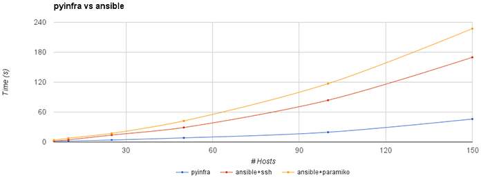

Performance
===========

This page contains a summary of the latest performance tests. The source code for the tests
is available `on GitHub <https://github.com/Fizzadar/pyinfra-performance>`_. You can also view the `full test results <https://github.com/Fizzadar/pyinfra-performance/blob/develop/latest_results.txt>`_.

**5 hosts**

.. code::

    --> Running tests: pyinfra -i tests/deploy/inventory.py tests/deploy/deploy.py

    --> First complete in 1.654032424 seconds
    --> Second complete in .903923313 seconds

    --> Running tests: ansible-playbook -i tests/playbook/inventory.py tests/playbook/playbook.yml -c ssh

    --> First complete in 2.015568222 seconds
    --> Second complete in 1.254801765 seconds

    --> Running tests: ansible-playbook -i tests/playbook/inventory.py tests/playbook/playbook.yml -c paramiko

    --> First complete in 3.721675592 seconds
    --> Second complete in 3.217463631 seconds

**10 hosts**

.. code::

    --> Running tests: pyinfra -i tests/deploy/inventory.py tests/deploy/deploy.py

    --> First complete in 1.979076484 seconds
    --> Second complete in 1.068944839 seconds

    --> Running tests: ansible-playbook -i tests/playbook/inventory.py tests/playbook/playbook.yml -c ssh

    --> First complete in 4.347069985 seconds
    --> Second complete in 2.925277140 seconds

    --> Running tests: ansible-playbook -i tests/playbook/inventory.py tests/playbook/playbook.yml -c paramiko

    --> First complete in 7.657454777 seconds
    --> Second complete in 6.705772392 seconds

**25 hosts**

.. code::

    --> Running tests: pyinfra -i tests/deploy/inventory.py tests/deploy/deploy.py

    --> First complete in 4.056870330 seconds
    --> Second complete in 1.739780331 seconds

    --> Running tests: ansible-playbook -i tests/playbook/inventory.py tests/playbook/playbook.yml -c ssh

    --> First complete in 13.995488838 seconds
    --> Second complete in 7.954871905 seconds

    --> Running tests: ansible-playbook -i tests/playbook/inventory.py tests/playbook/playbook.yml -c paramiko

    --> First complete in 17.409813055 seconds
    --> Second complete in 14.446487122 seconds

**50 hosts**

.. code::

    --> Running tests: pyinfra -i tests/deploy/inventory.py tests/deploy/deploy.py

    --> First complete in 8.364125808 seconds
    --> Second complete in 5.036991163 seconds

    --> Running tests: ansible-playbook -i tests/playbook/inventory.py tests/playbook/playbook.yml -c ssh

    --> First complete in 29.092618702 seconds
    --> Second complete in 17.804247488 seconds

    --> Running tests: ansible-playbook -i tests/playbook/inventory.py tests/playbook/playbook.yml -c paramiko

    --> First complete in 42.302565665 seconds
    --> Second complete in 38.529662848 seconds
